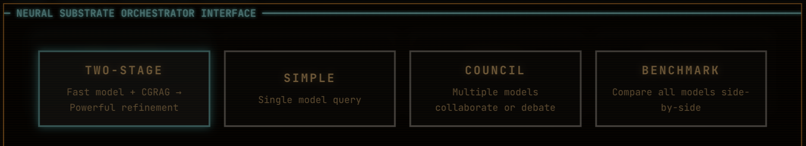

# S.Y.N.A.P.S.E. ENGINE

**Scalable Yoked Network for Adaptive Praxial System Emergence**

Distributed orchestration platform for local language models.



## What It Does

- **Multi-Model Orchestration** — Coordinate models across FAST/BALANCED/POWERFUL tiers
- **Query Modes** — Simple, Two-Stage, Council (Consensus/Debate), Benchmark
- **CGRAG** — Sub-100ms contextual retrieval with FAISS
- **Metal Acceleration** — One-click Apple Silicon GPU via Host API
- **WebUI-First** — All control in browser, no YAML editing

## Quick Start

### Prerequisites

- Docker Desktop
- GGUF models in `~/.cache/huggingface/hub/`
- llama-server at `/usr/local/bin/llama-server`

### Install & Run

```bash
git clone https://github.com/dlorp/synapse-engine.git
cd synapse-engine

cp .env.example .env
# Edit .env - set PRAXIS_MODEL_PATH

docker-compose up -d
```

**Ready in ~5 seconds.** No models loaded by default.

### First Query

1. Open http://localhost:5173
2. Go to **Model Management** → enable models → **START ALL ENABLED**
3. Select query mode (Two-Stage recommended)
4. Submit query

## Query Modes

| Mode | Description |
|------|-------------|
| **Simple** | Single model, direct response |
| **Two-Stage** | FAST tier + CGRAG → BALANCED/POWERFUL refinement |
| **Council (Consensus)** | Multiple models collaborate |
| **Council (Debate)** | Models argue, then synthesize |
| **Benchmark** | Compare all enabled models |

## Metal Acceleration (Apple Silicon)

2-3x faster inference with automatic Metal GPU via Host API.

```bash
# One-time setup
brew install llama.cpp
# Configure SSH (see docs/METAL.md)

# Then just click "START ALL ENABLED" in WebUI
```

Host API automatically manages Metal-accelerated llama-servers.

## API

```bash
# Query
POST /api/query
{
  "query": "Explain async patterns",
  "mode": "two-stage",
  "use_context": true
}

# Model control
POST /api/models/servers/start-all
POST /api/models/servers/stop-all
POST /api/models/servers/{id}/start
POST /api/models/servers/{id}/stop
```

Full docs: http://localhost:8000/docs

## Configuration

Key environment variables:

```bash
PRAXIS_MODEL_PATH=/Users/you/.cache/huggingface/hub/
NEURAL_LLAMA_SERVER_PATH=/usr/local/bin/llama-server
RECALL_TOKEN_BUDGET=8000
PRAXIS_DEFAULT_MODE=two-stage
USE_EXTERNAL_SERVERS=true  # Metal acceleration
```

## Documentation

- [Metal Acceleration](docs/METAL.md) — Apple Silicon GPU setup
- [Architecture](docs/ARCHITECTURE.md) — System design, model tiers
- [CGRAG](docs/CGRAG.md) — Document indexing, retrieval
- [Security](docs/SECURITY.md) — Localhost binding, reverse proxy
- [API Reference](docs/API.md) — Full endpoint documentation

## Development

```bash
# Hot reload enabled by default
docker-compose logs -f backend

# Tests
./scripts/test-all.sh
```

## Performance

- Docker startup: <5 seconds
- Model startup: 3-5s (Metal) / 10-15s (CPU)
- Simple query: <2 seconds
- Two-stage query: <15 seconds
- CGRAG retrieval: <100ms

## License

[PolyForm NonCommercial 1.0.0](LICENSE)

---

**Status:** v5.1 Production Ready
