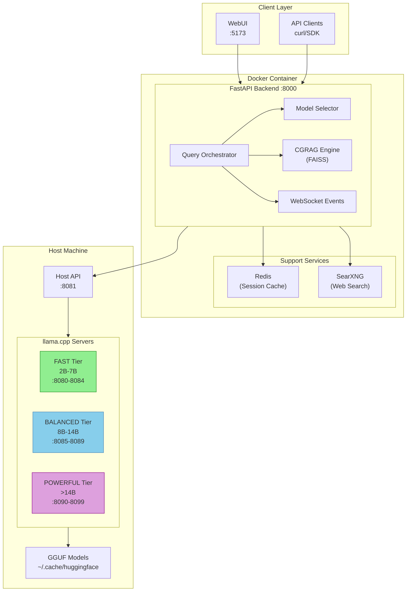
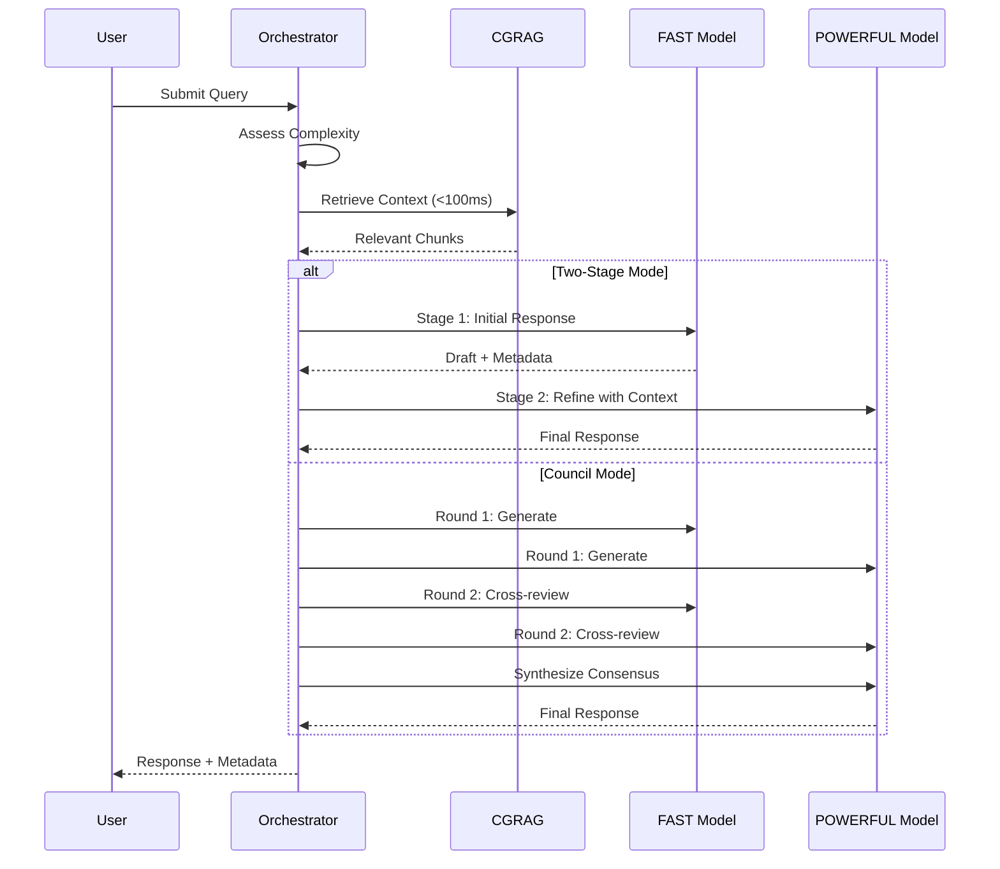

# Synapse Engine

[](LICENSE)
[](https://www.python.org/)
[](https://github.com/dlorp/synapse-engine/actions)

Distributed orchestration platform for local language models.


## What is this?

Synapse Engine coordinates multiple local LLMs into a unified inference system. Instead of running models one at a time, it orchestrates them across performance tiers—fast models for initial processing, powerful models for refinement—with sub-100ms contextual retrieval built in.

It runs entirely on your hardware. No API keys, no cloud dependencies, no data leaving your machine.

## Architecture



### Query Flow



## Features

- **Multi-Model Orchestration** - Coordinate models across FAST/BALANCED/POWERFUL tiers
- **Query Modes** - Simple, Two-Stage, Council (Consensus/Debate), Benchmark
- **CGRAG** - Sub-100ms contextual retrieval with FAISS
- **Metal Acceleration** - Apple Silicon GPU support via Host API
- **WebUI-First** - Full control in browser, no config files to edit

## Quick Start

### Prerequisites

- Docker Desktop
- GGUF models in `~/.cache/huggingface/hub/`
- llama-server at `/usr/local/bin/llama-server`

### Install and Run

```bash
git clone https://github.com/dlorp/synapse-engine.git
cd synapse-engine

cp .env.example .env
# Edit .env - set PRAXIS_MODEL_PATH to your models directory

docker-compose up -d
```

Ready in ~5 seconds. No models loaded by default.

### First Query

1. Open http://localhost:5173
2. Go to **Model Management** → enable models → **START ALL ENABLED**
3. Select query mode (Two-Stage recommended)
4. Submit query

## Query Modes

- **Simple** - Single model, direct response
- **Two-Stage** - FAST tier + CGRAG retrieval → BALANCED/POWERFUL refinement
- **Council (Consensus)** - Multiple models collaborate toward agreement
- **Council (Debate)** - Models argue positions, then synthesize
- **Benchmark** - Compare responses from all enabled models

## Usage

### API Examples

#### Basic Query

```bash
# Simple query (single model)
curl -X POST http://localhost:8000/api/query \
  -H "Content-Type: application/json" \
  -d '{"query": "What is Python?", "mode": "simple"}'

# Two-stage query with CGRAG context (default)
curl -X POST http://localhost:8000/api/query \
  -H "Content-Type: application/json" \
  -d '{
    "query": "Explain async patterns in Python",
    "mode": "two-stage",
    "use_context": true,
    "max_tokens": 2048
  }'

# Council consensus mode (3 models collaborate)
curl -X POST http://localhost:8000/api/query \
  -H "Content-Type: application/json" \
  -d '{
    "query": "What are the pros and cons of microservices?",
    "mode": "council",
    "council_mode": "consensus"
  }'

# Council debate mode (adversarial discussion)
curl -X POST http://localhost:8000/api/query \
  -H "Content-Type: application/json" \
  -d '{
    "query": "Should startups use Kubernetes from day one?",
    "mode": "council",
    "council_mode": "adversarial",
    "council_max_turns": 6
  }'
```

#### Model Management

```bash
# Get all discovered models
curl http://localhost:8000/api/models/registry

# Get running server status
curl http://localhost:8000/api/models/servers

# Start all enabled models
curl -X POST http://localhost:8000/api/models/servers/start-all

# Stop all running models
curl -X POST http://localhost:8000/api/models/servers/stop-all

# Start/stop individual model
curl -X POST http://localhost:8000/api/models/servers/qwen_7b_fast/start
curl -X POST http://localhost:8000/api/models/servers/qwen_7b_fast/stop

# Enable/disable model in registry
curl -X PUT http://localhost:8000/api/models/qwen_7b_fast/enabled \
  -H "Content-Type: application/json" \
  -d '{"enabled": true}'

# Change model tier
curl -X PUT http://localhost:8000/api/models/qwen_7b_fast/tier \
  -H "Content-Type: application/json" \
  -d '{"tier": "balanced"}'

# Rescan for new models
curl -X POST http://localhost:8000/api/models/rescan
```

#### CGRAG (Contextual Retrieval)

```bash
# Check index status
curl http://localhost:8000/api/cgrag/status

# Index a directory
curl -X POST http://localhost:8000/api/cgrag/index \
  -H "Content-Type: application/json" \
  -d '{
    "directory": "/app/docs",
    "chunk_size": 512,
    "chunk_overlap": 50
  }'

# List indexable directories
curl http://localhost:8000/api/cgrag/directories
```

#### Health & Monitoring

```bash
# Liveness probe (fast, <50ms)
curl http://localhost:8000/health/healthz

# Readiness probe (checks all dependencies)
curl http://localhost:8000/health/ready

# Get runtime settings
curl http://localhost:8000/api/settings

# Estimate VRAM for a model
curl "http://localhost:8000/api/settings/vram-estimate?model_size_b=14&quantization=Q4_K_M"
```

#### Context & Metrics

```bash
# Get context allocation for a query
curl http://localhost:8000/api/context/allocation/{query_id}

# Get context allocation stats
curl http://localhost:8000/api/context/stats
```

Full interactive API documentation: http://localhost:8000/docs (when running)

### Metal Acceleration (Apple Silicon)

Get 2-3x faster inference with automatic Metal GPU support:

```bash
brew install llama.cpp
# Configure SSH (see docs/METAL.md)
```

Then click "START ALL ENABLED" in WebUI-Host API handles the rest.

## Configuration

Key environment variables in `.env`:

```bash
PRAXIS_MODEL_PATH=/Users/you/.cache/huggingface/hub/
NEURAL_LLAMA_SERVER_PATH=/usr/local/bin/llama-server
RECALL_TOKEN_BUDGET=8000
PRAXIS_DEFAULT_MODE=two-stage
USE_EXTERNAL_SERVERS=true  # Enable Metal acceleration
```

## Performance

| Operation | Time |
|-----------|------|
| Docker startup | < 5 seconds |
| Model startup (Metal) | 3-5 seconds |
| Model startup (CPU) | 10-15 seconds |
| Simple query | < 2 seconds |
| Two-stage query | < 15 seconds |
| CGRAG retrieval | < 100ms |

## Documentation

- [Metal Acceleration](docs/METAL.md) - Apple Silicon GPU setup
- [Architecture](docs/ARCHITECTURE.md) - System design and model tiers
- [CGRAG](docs/CGRAG.md) - Document indexing and retrieval
- [Security](docs/SECURITY.md) - Localhost binding, reverse proxy setup
- [API Reference](docs/API.md) - Complete endpoint documentation

## Contributing

Contributions are welcome. Please open an issue to discuss changes before submitting a PR.

## License

[PolyForm NonCommercial 1.0.0](LICENSE)
