# Architecture

This document describes the system architecture of Synapse Engine, a distributed orchestration platform for local language models.

## System Overview


## Component Responsibilities

### PRAXIS (Backend Core)
- **Query Orchestrator**: Routes queries through appropriate processing modes
- **Model Selector**: Chooses models based on tier and availability
- **Pipeline Tracker**: Tracks query progress for visualization
- **Event Emitter**: WebSocket events for real-time UI updates

### NEURAL (Model Layer)
- **Host API**: Manages llama.cpp server lifecycle on host
- **Model Servers**: Individual llama.cpp instances per model
- **GPU Acceleration**: Metal support on Apple Silicon

### RECALL (Retrieval Layer)
- **CGRAG Engine**: Contextually-Guided Retrieval-Augmented Generation
- **FAISS Index**: Vector store for document embeddings
- **Chunker**: Splits documents into semantic chunks

### MEMEX (Cache Layer)
- **Redis**: Session state and response caching

---

## Three-Tier Model Management

### 1. Discovery (Automatic)
- Scans HuggingFace cache for GGUF models
- Extracts metadata: family, size, quantization
- Auto-assigns tier based on parameter count

### 2. Configuration (WebUI)
- Enable/disable models via checkboxes
- Override tier assignments
- Configure per-model runtime settings
- No YAML editing required

### 3. Activation (Dynamic)
- Click "START ALL" → servers launch
- No Docker restart needed
- Graceful shutdown when stopped

## Model Tiers

```mermaid
graph LR
    subgraph Tiers["Model Tiers"]
        Fast["🟢 FAST<br/>2B-7B<br/>Quick responses"]
        Balanced["🔵 BALANCED<br/>8B-14B<br/>Moderate complexity"]
        Powerful["🟣 POWERFUL<br/>>14B<br/>Complex queries"]
    end
    
    Fast --> |"Stage 1"| Balanced
    Balanced --> |"Refinement"| Powerful
```



| Tier | Size | Use Case | Typical Latency |
|------|------|----------|-----------------|
| FAST | 2B-7B | Quick responses, Stage 1, drafts | <3s |
| BALANCED | 8B-14B | Moderate complexity, refinement | 3-8s |
| POWERFUL | >14B | Complex queries, final synthesis | 5-15s |

---

## Execution Environment

| Component | Location | Purpose |
|-----------|----------|---------|
| FastAPI Backend | Docker | Orchestration, API |
| Redis | Docker | Session cache |
| SearXNG | Docker | Web search |
| Host API | Host | Server management |
| llama-server | Host | Model inference |
| Model files | Host | GGUF binaries |
| FAISS indexes | Docker (mounted) | Vector storage |

---

## Query Processing Modes

### Simple Mode
Single model, direct response with optional CGRAG context.


### Two-Stage Mode (Default)
FAST tier generates initial response, BALANCED/POWERFUL refines.


### Council Consensus Mode
Three models collaborate through two rounds toward agreement.


### Council Debate Mode
Two models take adversarial positions in multi-turn dialogue.


---

## CGRAG (Contextual Retrieval)

Sub-100ms contextual retrieval using FAISS vector similarity.


### Configuration

| Parameter | Default | Description |
|-----------|---------|-------------|
| `RECALL_CHUNK_SIZE` | 512 | Target chunk size in tokens |
| `RECALL_TOKEN_BUDGET` | 8000 | Max tokens in retrieved context |
| `RECALL_MIN_RELEVANCE` | 0.7 | Minimum similarity score |
| `RECALL_MAX_ARTIFACTS` | 10 | Max chunks to retrieve |

---

## Service Communication

### Internal (Docker Network)
```
Frontend  →  Backend     : http://backend:8000
Backend   →  Redis       : redis://redis:6379
Backend   →  SearXNG     : http://searxng:8080
```

### External (Host Bridge)
```
Backend   →  Host API    : http://host.docker.internal:8081
Host API  →  Models      : localhost:8080-8099
User      →  Frontend    : http://localhost:5173
User      →  Backend API : http://localhost:8000
```

---

## Real-Time Features

### WebSocket Events
- Query progress updates
- Server status changes
- CGRAG retrieval events
- Model routing decisions

### Dashboard Components
- **ProcessingPipelinePanel** - React Flow query visualization
- **ContextWindowPanel** - Token allocation display
- **AdvancedMetricsPanel** - Chart.js time series
- **SystemArchitectureDiagram** - Live topology view

---

## Performance Characteristics

| Operation | Time | Notes |
|-----------|------|-------|
| Docker startup | < 5 seconds | All services |
| Model startup (Metal) | 3-5 seconds | With GPU offload |
| Model startup (CPU) | 10-15 seconds | Fallback mode |
| Simple query | < 2 seconds | Single model |
| Two-stage query | < 15 seconds | FAST + POWERFUL |
| Council consensus | 30-60 seconds | 3 models, 2 rounds |
| Council debate | 60-120 seconds | Multi-turn dialogue |
| CGRAG retrieval | < 100ms | Vector similarity |
| Web search | 2-5 seconds | Via SearXNG |

---

## Security Model

- All services bound to localhost only
- No external network access by default
- Model files read-only from host
- Redis password-protected
- See [SECURITY.md](SECURITY.md) for production deployment
